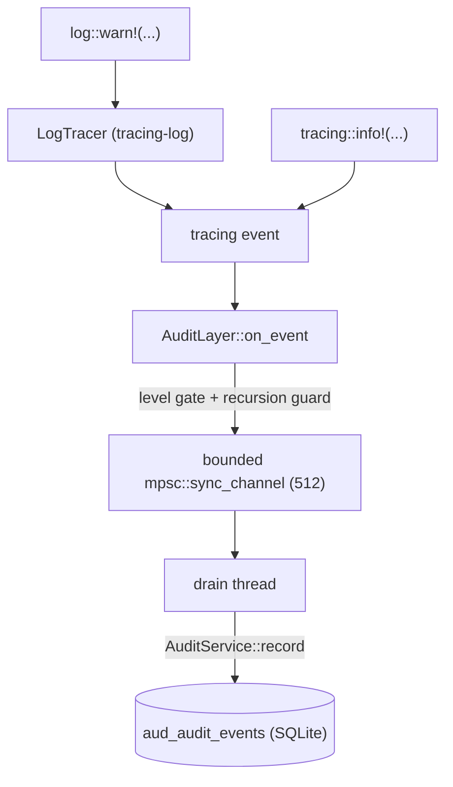

# DBFlux Audit System

DBFlux logs all significant operations to a unified audit trail stored in SQLite. This covers query execution, connection lifecycle, hook execution, script runs, MCP governance decisions, and configuration changes.

## Storage Location

All audit events are stored in the unified database:

```
~/.local/share/dbflux/dbflux.db
```

Table: `aud_audit_events`

The same database stores all other runtime state (profiles, history, sessions). The schema is managed by the migration system in `dbflux_storage/src/migrations/`.

## Event Structure

Every audit event is an `EventRecord` (`dbflux_core/src/observability/types.rs`) with these fields:

| Field | Type | Description |
|-------|------|-------------|
| `id` | `i64` | Auto-assigned on insert |
| `ts_ms` | `i64` | Unix timestamp in milliseconds |
| `level` | `EventSeverity` | `trace`, `debug`, `info`, `warn`, `error`, `fatal` |
| `category` | `EventCategory` | Domain of the event (see below) |
| `action` | `String` | Specific action identifier (e.g., `query_execute`) |
| `outcome` | `EventOutcome` | `success`, `failure`, `cancelled`, `pending` |
| `actor_type` | `EventActorType` | Who triggered the event |
| `actor_id` | `Option<String>` | Identity of the actor (MCP client ID, hook name, etc.) |
| `source_id` | `EventSourceId` | Where the event originated |
| `connection_id` | `Option<String>` | Connection profile ID |
| `database_name` | `Option<String>` | Target database name |
| `driver_id` | `Option<String>` | Driver ID (e.g., `postgres`, `mongodb`) |
| `object_type` | `Option<String>` | Type of object affected (e.g., `table`, `collection`) |
| `object_id` | `Option<String>` | ID/name of the specific object |
| `summary` | `String` | Human-readable description |
| `details_json` | `Option<String>` | Additional structured context as a JSON object |
| `error_code` | `Option<String>` | Error code on failure |
| `error_message` | `Option<String>` | Error message on failure |
| `duration_ms` | `Option<i64>` | Execution time in milliseconds |
| `session_id` | `Option<String>` | Session correlation ID |
| `correlation_id` | `Option<String>` | Cross-component correlation ID |

### Event Categories

| Category | String | What it captures |
|----------|--------|-----------------|
| `Query` | `query` | SQL execution, MongoDB queries, scan operations |
| `Connection` | `connection` | Connect, disconnect, reconnect lifecycle |
| `Hook` | `hook` | PreConnect, PostConnect, PreDisconnect, PostDisconnect |
| `Script` | `script` | Lua, Python, Bash script execution |
| `Mcp` | `mcp` | AI client tool calls and policy decisions |
| `Governance` | `governance` | Policy evaluation outcomes |
| `Config` | `config` | Profile changes, settings modifications |
| `System` | `system` | Application startup, panics, migrations |
| `ObjectStorage` | `object_storage` | Object-storage CRUD/mutation events (upload, delete, presign, rename, create bucket/folder, save-back edit) |

### Actor Types

| Type | String | Meaning |
|------|--------|---------|
| `User` | `user` | Human operating the DBFlux GUI |
| `System` | `system` | Background system operation |
| `App` | `app` | Application acting autonomously |
| `McpClient` | `mcp_client` | AI agent via MCP protocol |
| `Hook` | `hook` | Lifecycle hook script |
| `Script` | `script` | User-authored script |

### Required Fields Per Category

Validation is enforced by `AuditService::validate_event()` before storage:

| Category | Required beyond `action` + `summary` |
|----------|--------------------------------------|
| `Query` | `connection_id`, `driver_id`, `duration_ms` (for execution events) |
| `Connection` | `connection_id` |
| `Hook` | `object_type`, `object_id`, `connection_id` |
| `Script` | `object_type`, `object_id` |
| `Mcp` | `actor_id`, `object_id` (tool name) |
| `Config` | `object_type`, `object_id` |
| `ObjectStorage` | `connection_id`, `object_type`, `object_id` |
| `Governance`, `System` | No additional fields |

## Privacy and Redaction

By default, `AuditService` runs with these settings:

- **`redact_sensitive = true`**: Sensitive values (passwords, tokens, connection strings) in `details_json` and `error_message` are replaced with `[REDACTED]` before storage.
- **`capture_query_text = false`**: Full query text is never stored. Instead, a SHA256 fingerprint plus the original length are stored as `[FINGERPRINT:<16-char-hex>]` with `query_length`. This prevents sensitive data in queries from leaking into the audit log.
- **`max_detail_bytes = 65536`**: Payloads larger than 64 KiB are rejected to prevent storage bloat.

These can be changed at runtime via `AuditService::set_*()` methods. The MCP server exposes some of these via governance settings.

## Viewing Audit Events

### In the DBFlux UI

Navigate to **Workspace → Audit**. The unified audit view supports:

- Filtering by actor, tool/action, date range, decision, category
- Exporting filtered results to CSV or JSON

The same `AuditDocument` UI shell is also reused for driver-backed external event streams when a driver declares them through generic core abstractions (`CollectionPresentation`, `CollectionChildInfo`, `EventStreamTarget`). The UI must not special-case concrete drivers to open or render those streams.

### Directly via SQLite

The database is a standard SQLite file. Query it directly:

```bash
sqlite3 ~/.local/share/dbflux/dbflux.db
```

Useful queries:

```sql
-- All events in the last 24 hours
SELECT id, datetime(ts_ms/1000, 'unixepoch') as ts, level, category, action, outcome, actor_id, summary
FROM aud_audit_events
WHERE ts_ms > (unixepoch('now') - 86400) * 1000
ORDER BY ts_ms DESC;

-- MCP tool calls only
SELECT id, datetime(ts_ms/1000, 'unixepoch') as ts, actor_id, object_id as tool, outcome, summary
FROM aud_audit_events
WHERE category = 'mcp'
ORDER BY ts_ms DESC;

-- All failed operations
SELECT id, datetime(ts_ms/1000, 'unixepoch') as ts, category, action, actor_id, error_message
FROM aud_audit_events
WHERE outcome = 'failure'
ORDER BY ts_ms DESC
LIMIT 50;

-- Query events by connection
SELECT id, datetime(ts_ms/1000, 'unixepoch') as ts, action, driver_id, duration_ms, summary
FROM aud_audit_events
WHERE category = 'query' AND connection_id = 'your-connection-id'
ORDER BY ts_ms DESC;

-- Events grouped by category and outcome
SELECT category, outcome, count(*) as count
FROM aud_audit_events
GROUP BY category, outcome
ORDER BY category, outcome;
```

### Via MCP Tools (AI clients)

The MCP tool surface exposes three audit tools (classified as the `read` execution class):

```
query_audit_logs    — Filter events by actor, tool, date range, decision
get_audit_entry     — Retrieve a single event by ID
export_audit_logs   — Export filtered results as CSV or JSON
```

### Via Rust API

```rust
use dbflux_audit::{AuditService, AuditQueryFilter, AuditExportFormat};

let service = AuditService::new_sqlite_default()?;

// Query recent events
let filter = AuditQueryFilter {
    category: Some("mcp".to_string()),
    start_epoch_ms: Some(start_ms),
    limit: Some(100),
    ..Default::default()
};
let events = service.query(&filter)?;

// Export to CSV
let csv = service.export(&filter, AuditExportFormat::Csv)?;

// Export extended (all fields including details_json)
let json = service.export_extended(&filter, AuditExportFormat::Json)?;
```

## Generating Audit Events

### From Service Layers

Use the `EventSink` trait. All components that emit audit events accept an `Arc<dyn EventSink>`:

```rust
use dbflux_core::observability::{
    EventOrigin, EventRecord, EventSink,
    types::{EventCategory, EventSeverity, EventOutcome},
    actions,
};

// Build the event
let event = EventRecord::new(
    now_epoch_ms(),
    EventSeverity::Info,
    EventCategory::Query,
    EventOutcome::Success,
)
.with_typed_action(actions::QUERY_EXECUTE)
.with_summary("SELECT executed on users table")
.with_actor_id("my-actor-id")
.with_origin(EventOrigin::local())
.with_connection_context("my-profile-id", "mydb", "postgres")
.with_object_ref("table", "users")
.with_duration_ms(42);

// Emit through the sink (injected via constructor or DI)
event_sink.record(event)?;
```

### Canonical Action Constants

Action strings are defined in `dbflux_core/src/observability/actions.rs`. Use constants rather than bare strings:

| Constant | String | Category |
|----------|--------|----------|
| `QUERY_EXECUTE` | `query_execute` | Query |
| `QUERY_EXECUTE_FAILED` | `query_execute_failed` | Query |
| `CONNECTION_CONNECT` | `connection_connect` | Connection |
| `CONNECTION_DISCONNECT` | `connection_disconnect` | Connection |
| `HOOK_EXECUTE` | `hook_execute` | Hook |
| `HOOK_EXECUTE_FAILED` | `hook_execute_failed` | Hook |
| `SCRIPT_EXECUTE` | `script_execute` | Script |
| `SCRIPT_EXECUTE_FAILED` | `script_execute_failed` | Script |
| `MCP_AUTHORIZE` | `mcp_authorize` | Mcp |
| `MCP_APPROVE_EXECUTION` | `mcp_approve_execution` | Mcp |
| `MCP_REJECT_EXECUTION` | `mcp_reject_execution` | Mcp |
| `MCP_TOOL_EXECUTE` | `mcp_tool_execute` | Mcp |
| `MCP_TOOL_EXECUTE_FAILED` | `mcp_tool_execute_failed` | Mcp |
| `SYSTEM_PANIC` | `system_panic` | System |

### Required Fields Checklist

Before calling `record()`, ensure:

1. `action` is set and non-empty (use a constant from `actions`)
2. `summary` is set and non-empty (human-readable, one sentence)
3. Category-specific fields are present (see table above)
4. `details_json` is a valid JSON object if provided — not an array or primitive
5. `details_json` is under 64 KiB

### Failure Events

For failures, set outcome to `EventOutcome::Failure` and populate `error_code` and `error_message`:

```rust
let event = EventRecord::new(ts_ms, EventSeverity::Error, EventCategory::Query, EventOutcome::Failure)
    .with_typed_action(actions::QUERY_EXECUTE_FAILED)
    .with_summary("Query failed: syntax error")
    .with_connection("profile-id", Some("mydb"), Some("postgres"))
    .with_error("42601", "syntax error at or near \"SELEC\"");
```

`error_message` is redacted if it contains sensitive patterns. Use `error_code` for stable machine-readable error identifiers.

## Retention and Purge

Events can be purged by retention policy:

```rust
// Delete events older than 90 days, in batches of 500
let stats = service.purge_old_events(90, 500)?;
println!("Deleted {} events in {} batches", stats.deleted_count, stats.batches);
```

The purge is batched to avoid long write transactions. It is not run automatically — add it to a scheduled background task or operator runbook.

## Tracing to Audit Bridge

The tracing bridge captures structured events emitted by `log::*!` and `tracing::*!` macros across all DBFlux crates and writes them into the same `aud_audit_events` table without requiring call-site migration.

### Event Flow



### Bridge-Allowed Category

All events captured through the bridge are assigned category `System`. This is the V1 resolution: free-form log events do not carry the structured fields (`connection_id`, `object_type`, `object_id`) that other categories require, so routing them to `Connection` or `Config` would cause `validate_event` to reject them. The `PREFIX_CATEGORY_MAP` in `dbflux_core/src/observability/tracing_bridge/category.rs` maps module prefixes to intended categories for documentation purposes, but all resolved categories coerce to `System` at runtime.

### Capture Threshold

Only events at or above the configured `log_capture_min_level` are written to the audit store. `TRACE` and `DEBUG` are hard-filtered — they are never written regardless of the configured threshold.

The threshold is stored as a `u8` ordinal in an `Arc<AtomicU8>` and updated without subscriber reinit. The mapping is:

| Severity | Ordinal |
|----------|---------|
| Trace    | 0       |
| Debug    | 1       |
| Info     | 2       |
| Warn     | 3       |
| Error    | 4       |

The default threshold is `Info` (ordinal 2).

### Setting the Threshold

In the DBFlux UI: **Settings → Audit → Log Capture → Minimum Level** dropdown. Selecting a level and pressing Save persists it to `cfg_audit_settings.log_capture_min_level` (column added by migration 014) and applies it to the bridge atomically — no restart required.

In SQLite directly:

```sql
UPDATE cfg_audit_settings SET log_capture_min_level = 'warn';
```

Valid values: `trace`, `debug`, `info`, `warn`, `error`.

### Drop Counter

When the bounded channel is full (512 events by default, configurable via `BridgeConfig::queue_capacity`), the bridge drops the incoming event rather than blocking and increments an `Arc<AtomicU64>` drop counter. This prevents the audit path from introducing backpressure into application code. The current drop count is accessible via `BridgeHandle::drop_count()` and is exposed through `AuditService::dropped_log_event_count()` for observability, but is not persisted or surfaced in the UI in V1.

### Startup Window

There is a brief gap between process start and sink installation during which events are captured into the drain channel but not yet flushed to SQLite — the sink is installed after `AppState` is constructed and the first audit settings read completes. Events in-flight during this window are held in the bounded channel and delivered once the sink is installed. If the channel fills during the startup window, events are dropped and counted.

### Recursion Guard

Events emitted from `dbflux_core::observability::tracing_bridge` are excluded from the bridge to prevent feedback loops where bridge diagnostics feed back into themselves. This is enforced by the `BRIDGE_INTERNAL_TARGET` constant checked in `AuditLayer::on_event`.

### Target Allowlist

Only events whose `target` starts with `dbflux` are mirrored to the audit store. Upstream dependencies such as `gpui`, `blade_graphics`, `naga`, `wgpu`, `hyper`, and `tokio` emit verbose `INFO`-level traces (render-loop texture and buffer lifecycle, surface present mode, HTTP request lifecycle, etc.) that would otherwise drown the audit log in operational noise without any value for after-the-fact diagnosis.

These events still flow through the fmt layer and remain visible in stderr (or the log file) per `RUST_LOG`. The gate lives in `passes_target_gate` in `layer.rs` and runs before record construction.

To audit an event from a non-`dbflux` source, wrap the emission in a dbflux module and re-emit with a dbflux target — the bridge intentionally does not let upstream targets through.

### Named Tracing Fields

The bridge recognizes these named fields on tracing events and maps them to `EventRecord` fields:

| Tracing field | `EventRecord` field |
|---------------|---------------------|
| `message` | `summary` |
| `category` | `category` (coerced to `System`) |

The fields `actor_type`, `actor_id`, `connection_id`, `database_name`, `driver_id`, `action`, `outcome`, and `details_json` are recognized as well and map to the `EventRecord` field of the same name.

Unknown fields accumulate in `details_json` as a JSON object. If the message exceeds 512 characters it is truncated with `…` and the full message is stored in `details_json["message"]`.

The bridge also maps `correlation_id` directly to `EventRecord.correlation_id` (not into `details_json`), enabling cross-component correlation between user-facing error toasts and their corresponding audit records.

### User-Facing Error Events

User-facing errors (storage failures, driver errors, network problems, config persistence failures) are reported through `report_error` / `report_error_async` from `dbflux_ui_base::user_error`. Each call emits a tracing event that flows through the bridge and also pushes a toast notification.

The tracing event shape:

| Tracing field | Value |
|---------------|-------|
| `target` | `dbflux_ui::user_error` |
| `action` | `user_error` |
| `outcome` | `failure` |
| `kind` | `ErrorKind` as string (`storage`, `network`, `auth`, `hook`, `driver`, `user`, `config`) |
| `correlation_id` | UUID v7 linking the toast to the audit record |
| `message` | The human-readable summary shown in the toast |

The `correlation_id` field is extracted by `AuditFieldVisitor` into `EventRecord.correlation_id`. Note that the visitor routes both `record_str` (Display sigil `%val`) and `record_debug` (Debug sigil `?val`) through the same `record_string_by_name` dispatcher, so new typed slots added in the future are picked up regardless of which sigil the caller uses.

There are two paths from the UI back into the audit document:

- **Per-toast "View in Audit" action** — emits `OpenAuditRequested(Some(correlation_id))`. The workspace opens (or focuses) the Audit document and applies the matching correlation filter so the user sees exactly the one event tied to the toast.
- **Status-bar error badge click** — emits `OpenAuditRequested(None)`. The workspace opens the Audit document with the default user-error filter (`target = dbflux_ui::user_error` over a recent time window) so the user can browse every recent user-facing failure.

Both events flow through `AppStateEntity::request_open_audit` so the workspace subscribes once.

Severity mapping from `EventSeverity`:
- `EventSeverity::Info` and `EventSeverity::Warn` — emitted at `WARN` level; throttled (5-token bucket, 1 refill per 2 seconds, per severity)
- `EventSeverity::Error` and `EventSeverity::Fatal` — emitted at `ERROR` level; bypass throttle

### Enabling the Bridge

The bridge is enabled by building `dbflux_core` with the `tracing-bridge` feature (on by default for `dbflux`, `dbflux_mcp_server`). Call `init_tracing(BridgeConfig { .. })` once at process start:

```rust
use dbflux_core::observability::tracing_bridge::{init_tracing, BridgeConfig, FmtWriter};

let handle = init_tracing(BridgeConfig {
    include_audit_layer: true,
    fmt_writer: FmtWriter::Stderr,
    env_filter_default: "info",
    ..BridgeConfig::default()
})?;

// Later, after AuditService is ready:
handle.install_sink(Arc::new(audit_service));
```

`dbflux_driver_host` uses `include_audit_layer: false` because driver host processes are ephemeral and do not have access to the audit SQLite database.

### Key Files

| File | Role |
|------|------|
| `crates/dbflux_core/src/observability/tracing_bridge/mod.rs` | `init_tracing`, `BridgeHandle`, `BridgeConfig`, `LevelCode` |
| `crates/dbflux_core/src/observability/tracing_bridge/layer.rs` | `AuditLayer`, `AuditFieldVisitor`, level gate |
| `crates/dbflux_core/src/observability/tracing_bridge/category.rs` | `PREFIX_CATEGORY_MAP`, `resolve_category`, `BRIDGE_INTERNAL_TARGET` |
| `crates/dbflux_storage/src/migrations/mod_014_audit_settings_log_capture_min_level.rs` | Adds `log_capture_min_level` column to `cfg_audit_settings` |

## External Audit Emission (RPC drivers and auth providers)

External RPC drivers (protocol v1.2+) and auth providers (protocol v1.3+) may emit audit events back to the host as intermediate response frames. The host applies strict sanitization before writing to `aud_audit_events`.

### Host-authoritative policy

The host owns all identity, correlation, and rate-limiting fields. An external service can never forge its own identity or claim an audit category it is not permitted to use.

| Field | Source |
|-------|--------|
| `actor_type` | Always `ExternalDriver` or `ExternalAuthProvider` |
| `source_id` | Always `ExternalDriver` / `ExternalAuthProvider` with the registered `socket_id` |
| `actor_id` | Always `rpc:<socket_id>` |
| `connection_id` | Host-supplied from session context (may be `None`) |
| `database_name` | Host-supplied from session context (may be `None`) |
| `driver_id` | Always `rpc:<socket_id>` |
| `correlation_id` | Host-generated; one per session for drivers, one per request for auth providers |
| `ts_ms` | Service-supplied but clamped if drift from host wall clock exceeds five minutes |

`correlation_id` is structurally guaranteed to be host-generated because `AuditEventEmitDto` (the IPC payload type) has no `correlation_id` field. External services cannot supply one — the field was intentionally omitted from the DTO at design time (ADR-3) rather than accepted and validated away. As a result, the scenario "driver DTO carries a forged correlation_id and the host overrides it at runtime" is impossible at the type level; the stored value is always produced by the host's correlation-id allocation logic.

### Category whitelist

Drivers may emit `Connection`, `Query`, and `System` events. Auth providers may emit only `Connection` events. Any frame with a disallowed category is silently dropped.

### Rate limiting

Each external service (by `socket_id`) is limited to 100 events per 60 seconds via a token-bucket. Frames that exceed the budget are dropped and counted in `AuditService::external_audit_dropped_count()`.

### Opt-in flags

- **Drivers**: The driver must include `DriverCapability::AuditEmit` in its hello response (protocol v1.2+). Frames sent by drivers that did not advertise this capability are silently discarded.
- **Auth providers**: The provider must set `audit_emit_opt_in: true` in its hello response (protocol v1.3+). Frames from providers that did not opt in are silently discarded.

### Required fields on every emitted frame

An emitted `AuditEventEmitDto` must have non-empty `action` and `summary`. Frames failing this check are dropped silently.

### Transport mechanism

Emitted frames arrive as `done=false` intermediate frames inside a normal response sequence. The transport layer (`RpcClient` in `dbflux_driver_ipc`, `RpcAuthProvider::dispatch_request_loop` in `dbflux_ipc`) intercepts them before they reach the caller. The caller only ever sees the terminal frame.

### Key files

| File | Role |
|------|------|
| `crates/dbflux_ipc/src/audit.rs` | `AuditEventEmitDto`, `ExternalAuditEmitter` trait, `ExternalAuditSource` |
| `crates/dbflux_app/src/rpc_services/external_audit.rs` | `ExternalAuditSink`, token-bucket rate limiter, sanitization pipeline |
| `crates/dbflux_driver_ipc/src/transport.rs` | `RpcClient::send_raw` intercepts driver emit frames |
| `crates/dbflux_ipc/src/auth_provider_client.rs` | `dispatch_request_loop` intercepts auth-provider emit frames |

## Architecture

```
[Service layers]
  |  emit EventRecord via EventSink trait
  v
AuditService              (dbflux_audit/src/lib.rs)
  |  validate → fingerprint query text → redact sensitive values → enforce size limit
  v
SqliteAuditStore          (dbflux_audit/src/store/sqlite.rs)
  |  delegates to AuditRepository
  v
AuditRepository           (dbflux_storage/src/repositories/audit.rs)
  |  inserts into aud_audit_events
  v
~/.local/share/dbflux/dbflux.db
```

Key files:

| File | Role |
|------|------|
| `crates/dbflux_core/src/observability/types.rs` | `EventRecord`, all enum types |
| `crates/dbflux_core/src/observability/actions.rs` | Canonical action string constants |
| `crates/dbflux_audit/src/lib.rs` | `AuditService` — validate, preprocess, record |
| `crates/dbflux_audit/src/query.rs` | `AuditQueryFilter` |
| `crates/dbflux_audit/src/export.rs` | CSV/JSON export (basic and extended) |
| `crates/dbflux_audit/src/redaction.rs` | Sensitive value redaction logic |
| `crates/dbflux_audit/src/purge.rs` | Retention-based event purge |
| `crates/dbflux_audit/src/store/sqlite.rs` | SQLite store adapter |
| `crates/dbflux_storage/src/repositories/audit.rs` | `AuditRepository` + `AuditEventDto` |
