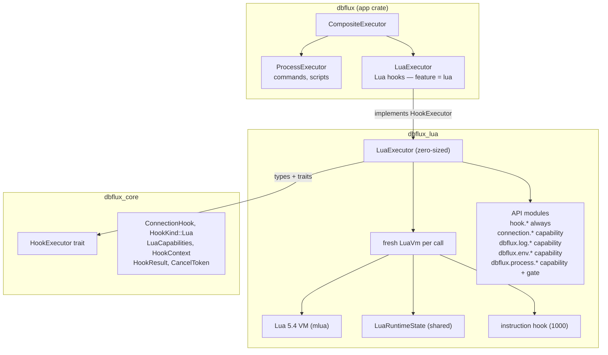

# The Embedded Lua Runtime

The `dbflux_lua` crate is DBFlux's sandboxed Lua 5.4 runtime for connection hooks. This document describes the crate's architecture, the Lua API exposed to hook scripts, the sandbox and timeout model, and how the runtime is wired into the application.

---

## What This Crate Does

`dbflux_lua` lets users write Lua scripts that run during connection lifecycle events (pre-connect, post-connect, pre-disconnect, post-disconnect). The hooks are general-purpose: they can drive SSO login flows, environment setup, audit logging, or triggering external tools before/after a connection opens.

The crate exposes exactly one public type: `LuaExecutor`. Everything else — the VM factory, the API modules, the shared state — is crate-internal. From the outside, you call `executor.execute_hook(hook, context, cancel_token, parent_cancel_token, output, detached)` and get back a `HookResult`. The final `detached: Option<&DetachedProcessSender>` argument lets the executor hand long-running detached processes back to the caller.

---

## Architecture Overview



The key design principle: **a fresh Lua VM is created for every hook execution**. No VM pooling, no state leaking between runs. This makes the sandbox trivially safe — even if a script somehow corrupts the VM state, it's thrown away after execution.

---

## Dependencies

| Dependency    | Version   | Purpose                                                                                                |
| ------------- | --------- | ------------------------------------------------------------------------------------------------------ |
| `mlua`        | 0.10      | Lua 5.4 bindings. Features: `lua54`, `send` (makes `Lua: Send`), `vendored` (compiles Lua from source) |
| `dbflux_core` | workspace | Traits (`HookExecutor`), types (`ConnectionHook`, `HookContext`, etc.)                                 |
| `log`         | 0.4       | Rust-side logging from Lua callbacks                                                                   |

The `vendored` feature is important — it means no system Lua installation is required. The Lua 5.4 interpreter is compiled from C source and statically linked. This removes a deployment dependency but adds ~200KB to the binary.

---

## The Sandbox

### What's Loaded

Only four Lua standard libraries:

```rust
let stdlib = StdLib::TABLE | StdLib::STRING | StdLib::MATH | StdLib::UTF8;
let lua = Lua::new_with(stdlib, LuaOptions::default())?;
```

This gives scripts access to:

- **table**: `table.insert`, `table.remove`, `table.sort`, `table.concat`, `table.pack`, `table.unpack`
- **string**: `string.format`, `string.find`, `string.gsub`, `string.sub`, `string.len`, `string.match`, `string.rep`, pattern matching
- **math**: `math.floor`, `math.ceil`, `math.random`, `math.sqrt`, `math.abs`, `math.max`, `math.min`, `math.pi`
- **utf8**: `utf8.char`, `utf8.codepoint`, `utf8.len`

Plus the Lua built-ins that don't require library loading: `type()`, `tostring()`, `tonumber()`, `pairs()`, `ipairs()`, `next()`, `select()`, `pcall()`, `xpcall()`, `error()`, `setmetatable()`, `getmetatable()`, `rawget()`, `rawset()`, `rawequal()`, `rawlen()`. Closures, local variables, metatables, all the control flow — everything that makes Lua _Lua_ works fine.

### What's Blocked

| Library     | Why it's blocked                                                                                                                                             |
| ----------- | ------------------------------------------------------------------------------------------------------------------------------------------------------------ |
| `io`        | File read/write. Can't let hooks read arbitrary files or write to disk.                                                                                      |
| `os`        | System calls: `os.execute()` would be a full shell escape, `os.remove()` can delete files. Even `os.getenv()` is replaced with the gated `dbflux.env.get()`. |
| `debug`     | `debug.sethook()` could interfere with the instruction-count interrupt. `debug.getlocal()` and `debug.getinfo()` could inspect internal state.               |
| `package`   | `require()`, `dofile()`, `loadfile()` would allow loading arbitrary code from disk.                                                                          |
| `coroutine` | Not dangerous per se, but adds complexity to the timeout/cancellation model (coroutines can yield past the instruction hook).                                |

The sandbox is "allowlist, not blocklist." Only the four explicitly loaded libraries plus the registered API functions exist. If it's not in the list above, it doesn't exist in the Lua VM.

### Memory Limit

Each VM is created with an enforced memory cap of 16 MiB (`lua.set_memory_limit(16 * 1024 * 1024)` in `engine.rs`). A script that allocates past this limit fails with a memory error rather than being allowed to exhaust the host's memory.

---

## The Lua API

### `hook.*` — Always Available

This is the core control flow API. Every Lua hook script communicates its result through these functions.

```lua
-- Read the current phase
local phase = hook.phase  -- "pre_connect", "post_connect", ...

-- Signal outcomes
hook.ok()           -- success (this is the default if nothing is called)
hook.warn("msg")    -- success, but surface a warning to the user
hook.fail("msg")    -- failure, abort the connection flow
```

The outcome is a simple state machine with three states: `Ok`, `Warn(msg)`, `Fail(msg)`. **Multiple calls overwrite** — only the last call before the script exits matters. If the script completes without calling any of these, the outcome defaults to `Ok`.

The outcome maps to `HookResult` like this:

| Outcome     | `exit_code` | `stderr` | `warnings` |
| ----------- | ----------- | -------- | ---------- |
| `Ok`        | `0`         | empty    | `[]`       |
| `Warn(msg)` | `0`         | empty    | `[msg]`    |
| `Fail(msg)` | `1`         | `msg`    | `[]`       |

### `connection.*` — Connection Metadata

Gated by `capabilities.connection_metadata` (default: **true**).

```lua
connection.profile_id     -- "550e8400-e29b-41d4-a716-446655440000"
connection.profile_name   -- "Production DB"
connection.db_kind        -- "Postgres", "SQLite", "MongoDB", "Redis", "MySQL"
connection.host           -- "db.example.com" or nil (SQLite has no host)
connection.port           -- 5432 or nil
connection.database       -- "myapp" or nil
```

All values are **static snapshots** taken at VM creation. They cannot be changed by the script. This is intentional — hooks observe the connection, they don't configure it.

### `dbflux.log.*` — Logging

Gated by `capabilities.logging` (default: **true**).

```lua
dbflux.log.info("Starting SSO flow")
dbflux.log.warn("Token expires in 5 minutes")
dbflux.log.error("AWS CLI not found")
```

Each call does two things:

1. Appends `[LEVEL] message` to an internal log buffer (which becomes the `stdout` of `HookResult`)
2. Forwards to Rust's `log` crate at the corresponding level, prefixed with `[lua]`

When the caller provides an output channel, the same log line is also streamed immediately to the UI. The log buffer is still the primary durable output for the final `HookResult`.

### `dbflux.env.*` — Environment Variables

Gated by `capabilities.env_read` (default: **true**).

```lua
local home = dbflux.env.get("HOME")          -- "/home/user" or nil
local profile = dbflux.env.get("AWS_PROFILE") -- "production" or nil

if not dbflux.env.get("DATABASE_URL") then
    hook.fail("DATABASE_URL is not set")
end
```

Read-only. No `set()` or `unset()` — hooks cannot modify the environment. This replaces `os.getenv()` which would require loading the unsafe `os` library.

### `dbflux.process.*` — Controlled Process Execution

Gated by `capabilities.process_run` (default: **false**). Must be explicitly opted in.

Even when enabled, the process API is **double-gated** by an allowlist system. You can't run arbitrary programs — only specific tools from predefined categories.

```lua
local result = dbflux.process.run({
    program = "aws",
    allowlist = "aws_cli",
    args = { "sso", "login", "--profile", "prod" },
    timeout_ms = 120000,
    cwd = "/home/user",
    stream = true,
})

if not result.ok then
    hook.fail("AWS SSO login failed: " .. result.stderr)
end

dbflux.log.info("AWS SSO login succeeded")
hook.ok()
```

**Input options:**

| Field        | Type     | Required | Description                                                            |
| ------------ | -------- | -------- | ---------------------------------------------------------------------- |
| `program`    | string   | yes      | Bare command name (no path separators)                                 |
| `allowlist`  | string   | yes      | Must match a known allowlist name                                      |
| `args`       | string[] | no       | Command arguments                                                      |
| `timeout_ms` | integer  | no\*     | Per-process timeout (ms). Hook-level timeout still applies above this. |
| `cwd`        | string   | no       | Working directory                                                      |
| `stream`     | boolean  | no       | Stream stdout/stderr to the caller while the process is still running  |
| `detached`   | boolean  | no       | Hand the spawned process back to the caller and return immediately, instead of waiting for it to exit |

\* For a non-detached `run`, `timeout_ms` is effectively required when there is no hook-level timeout: a call with neither a `timeout_ms` nor a hook-level timeout fails with the runtime error `"dbflux.process.run requires a timeout_ms when no hook-level timeout is set"`. A detached `run` is exempt from this constraint.

**Return value:**

| Field       | Description                                |
| ----------- | ------------------------------------------ |
| `ok`        | boolean. `true` if the process was detached, or if exit code is 0 and not timed out |
| `detached`  | boolean. `true` if the process was handed off as detached (in which case the output/exit fields below are empty/nil) |
| `exit_code` | integer/nil. Process exit code             |
| `stdout`    | string. Captured stdout                    |
| `stderr`    | string. Captured stderr                    |
| `timed_out` | boolean. `true` if per-process timeout fired |

**Available allowlists:**

| Allowlist     | Allowed programs                                 |
| ------------- | ------------------------------------------------ |
| `aws_cli`     | `aws`, `aws.exe`                                 |
| `python_cli`  | `python`, `python.exe`, `python3`, `python3.exe` |
| `ssh_cli`     | `ssh`, `ssh.exe`                                 |
| `cloudflared` | `cloudflared`, `cloudflared.exe`                 |
| `gcloud_cli`  | `gcloud`, `gcloud.cmd`, `gcloud.exe`             |
| `az_cli`      | `az`, `az.cmd`, `az.exe`                         |

`program` must be a **bare command name**. Path-qualified names are rejected before the allowlist is checked: any program containing a `/` or `\`, made up of multiple path components, or starting with `~` fails with the runtime error `"Program '...' must be a bare command name (no path separators)"`. So `program = "/usr/local/bin/aws"` is rejected outright — pass `program = "aws"` instead and let it resolve via `PATH`. Matching of the bare name against the allowlist is case-insensitive.

This design serves a specific use case: hooks that need to trigger cloud CLI tools (SSO login, tunnel setup, secrets retrieval) without opening a full shell escape. The allowlist is an ergonomics and footgun guard — it prevents typos and accidental execution of unexpected programs. It is **not** a security isolation boundary: a user who controls `PATH` can still substitute a different binary under the same name. The hardcoded allowlists can be extended later as new use cases emerge.

---

## Timeout and Cancellation

There are three layers of interruption, and understanding how they interact is important.

### Layer 1: Lua Instruction Hook

```rust
lua.set_hook(
    HookTriggers::new().every_nth_instruction(1_000),
    move |_lua, _debug| { ... }
);
```

Every 1,000 Lua instructions, the hook fires and checks:

1. Is the cancel token set? → `RuntimeError("Lua hook cancelled")`
2. Has the timeout elapsed? → `RuntimeError("Lua hook timed out")`

This catches infinite loops, runaway computations, and long-running pure-Lua code. The 1,000-instruction interval is a balance between responsiveness (checking often) and performance (checking is not free).

**Limitation**: This hook only fires for Lua bytecode instructions. If the script calls a blocking Rust function (like `dbflux.process.run`), the instruction hook won't fire until that function returns. That's why...

### Layer 2: Shared Process Executor

Inside `dbflux.process.run`, process execution is delegated to the shared `dbflux_core::execute_streaming_process()` helper. That helper:

- spawns reader threads for stdout and stderr
- pushes output chunks through a channel
- checks cancel tokens and timeouts on a short interval
- kills the child on cancellation or timeout
- returns a normal result table for per-process timeout, or a Lua runtime error for hook-level cancellation/timeout

This keeps Lua hooks and non-Lua script hooks aligned. The same low-level process execution path is used for Bash, Python, and Lua-triggered subprocesses.

### Layer 3: Parent Cancel Token

The connection flow passes a parent cancel token that cancels all hooks when the overall connect/disconnect operation is aborted. Both the instruction hook and the shared process executor check this token alongside the hook-specific one.

### Timeout Hierarchy

```
Hook-level timeout (e.g., 30s)
  └── Process-level timeout (e.g., 120s for SSO login)
        └── Actually, process timeout < hook timeout to be useful
```

If the hook-level timeout fires while a process is running, the process is killed and the entire hook aborts with a Lua timeout error, which `LuaExecutor` converts into `HookResult { timed_out: true }`.

If the process-level timeout fires, only that process is killed. The script continues executing and can handle the timeout gracefully:

```lua
local result = dbflux.process.run({ ..., timeout_ms = 5000 })
if result.timed_out then
    dbflux.log.warn("Process timed out, falling back to cached credentials")
end
```

---

## Error Handling

### How Errors Flow

```
Script execution
    │
    ├─ Completes normally → outcome (Ok/Warn/Fail) determines HookResult
    │
    ├─ "Lua hook cancelled" → Err(String) returned to caller
    │                          (the ONLY case that returns Err)
    │
    ├─ "Lua hook timed out" → Ok(HookResult { timed_out: true })
    │
    └─ Any other Lua error → Ok(HookResult { exit_code: 1, stderr: error_msg })
```

Cancellation is the only case that returns `Err` from `execute_hook`. Timeouts and runtime errors are normal "the hook failed" outcomes and are captured in `HookResult`.

### Sentinel-Based Error Detection

mlua wraps errors in layers of `CallbackError` and `WithContext`. To detect cancellation vs. timeout, the code uses a recursive `error_has_message` function that unwraps these layers looking for the exact sentinel strings `"Lua hook cancelled"` and `"Lua hook timed out"`.

This is a pragmatic workaround. A cleaner approach would be custom error types, but mlua's error model makes that impractical without fighting the library. The sentinel approach works reliably because these exact strings are only produced by our instruction hook and shared process execution path.

---

## LuaCapabilities

Defined in `dbflux_core::connection::hook`:

```rust
pub struct LuaCapabilities {
    pub logging: bool,              // default: true
    pub env_read: bool,             // default: true
    pub connection_metadata: bool,  // default: true
    pub process_run: bool,          // default: false
}
```

These are configured per-hook in the Settings UI. The defaults are deliberately conservative — `process_run` is the only dangerous capability, and it's off by default.

The capability checks happen at VM creation time, not at call time. If `logging` is false, the `dbflux.log` table simply doesn't exist in the VM. There's no runtime check; the sandbox is structural.

---

## Internal Architecture Details

### LuaRuntimeState

```rust
pub struct LuaRuntimeState {
    pub outcome: Arc<Mutex<LuaHookOutcome>>,
    pub log_buffer: Arc<Mutex<Vec<String>>>,
    pub output: Option<OutputSender>,
    pub detached: Option<DetachedProcessSender>,
    pub cancel_token: CancelToken,
    pub parent_cancel_token: Option<CancelToken>,
    pub hook_started_at: Instant,
    pub hook_timeout: Option<Duration>,
}
```

This is the shared mutable state that Lua callbacks and the executor both access. The `Arc<Mutex<...>>` pattern is necessary because Lua closures (registered as API functions) capture cloned `Arc`s, and the executor reads the final state after script execution.

The `output` sender is optional. When present, Lua log calls and `dbflux.process.run({ stream = true })` forward live output to the UI while still preserving the final buffered output in `HookResult`.

The `cancel_token` and timing fields are also shared with process execution, creating a single view of the execution context across all layers.

### LuaVmConfig

`LuaEngine::create_vm()` takes a `LuaVmConfig` struct rather than a long argument list. It bundles the hook context, phase, capabilities, cancel state, optional output sender, and timeout metadata needed to build a fresh VM.

### LuaVm

```rust
pub struct LuaVm {
    pub lua: Lua,
    pub state: LuaRuntimeState,
}
```

Bundles the Lua VM and shared state so the executor can access both. After `vm.lua.load(&script).exec()` completes, the executor reads `vm.state.log_buffer` and `vm.state.outcome` to build the `HookResult`.

### The `dbflux` Table Lazy Init Pattern

```rust
fn ensure_dbflux_table(lua: &Lua) -> LuaResult<Table> {
    let globals = lua.globals();
    match globals.get::<Table>("dbflux") {
        Ok(table) => Ok(table),
        Err(_) => {
            let table = lua.create_table()?;
            globals.set("dbflux", table.clone())?;
            Ok(table)
        }
    }
}
```

Each `register_*_api` function calls this to get-or-create the `dbflux` global. This allows capabilities to be registered independently without knowing about each other — each just adds its sub-table to the shared parent.

---

## Script Style Guide

Based on the test cases and the API design, here's the idiomatic way to write Lua hooks:

### Basic Hook

```lua
dbflux.log.info("Pre-connect hook for " .. connection.profile_name)

if connection.db_kind == "Postgres" and hook.phase == "pre_connect" then
    local db_url = dbflux.env.get("DATABASE_URL")
    if not db_url then
        hook.fail("DATABASE_URL environment variable is not set")
        return
    end
end

hook.ok()
```

### SSO Login Hook

```lua
local result = dbflux.process.run({
    program = "aws",
    allowlist = "aws_cli",
    args = { "sso", "login", "--profile", connection.profile_name },
    timeout_ms = 120000,
})

if not result.ok then
    hook.fail("AWS SSO login failed: " .. result.stderr)
    return
end

dbflux.log.info("AWS SSO login completed successfully")
hook.ok()
```

### Conditional by Phase

```lua
if hook.phase == "pre_connect" then
    dbflux.log.info("Establishing tunnel...")
    -- setup logic
elseif hook.phase == "post_disconnect" then
    dbflux.log.info("Cleaning up...")
    -- teardown logic
end
```

### Error Handling Pattern

```lua
-- Use pcall for operations that might fail
local ok, err = pcall(function()
    -- risky operations here
end)

if not ok then
    hook.fail("Unexpected error: " .. tostring(err))
    return
end
```

### Conventions

- **Use `return` after `hook.fail()`** — The script continues executing after `hook.fail()`, which just sets a flag. If you don't return, subsequent code might call `hook.ok()` and overwrite the failure. The last call wins.
- **Log liberally** — `dbflux.log.info()` output appears in the result panel. It's the only way to communicate progress and debug issues.
- **Check `result.ok` not `result.exit_code`** — The `ok` field accounts for both exit code and timeout. `exit_code` can be `nil` in edge cases.
- **Don't rely on `hook.phase` being missing in the editor** — When running a script from the code editor's Run button (not as part of a connection flow), the phase defaults to `"pre_connect"`. Phase-dependent logic should handle this gracefully.

---

## Limitations

### No Async

Everything is synchronous and blocking. The Lua VM runs on a background thread, and `dbflux.process.run` blocks that thread until the shared process executor finishes. For most hook use cases (CLI tool calls, environment checks), this is fine. But you can't do async HTTP requests or parallel operations.

### No Network Access

There's no HTTP client, socket library, or network API. The only way to interact with external services is through `dbflux.process.run` with an allowlisted CLI tool. This is intentional — a sandboxed HTTP client would need careful URL filtering and would expand the attack surface significantly.

### No File I/O

No `io.open`, no `os.rename`, no direct file reading or writing from Lua itself. If you need data from the outside world, you have to go through an allowlisted process such as Python or a cloud CLI.

### No Persistent State

Each hook execution creates a fresh VM. There's no way to store state between invocations. If you need persistent state, write it to a file via an external process and read it back in the next invocation.

### No `require()`

The `package` library is not loaded, so `require()` doesn't exist. You can't split Lua code across multiple files or use third-party Lua libraries. All hook logic must be self-contained in a single script.

### No `os.time()` or `os.clock()`

The `os` library is blocked entirely. If you need timing, you'll have to measure externally. This also means `math.randomseed(os.time())` doesn't work — `math.random()` uses whatever seed mlua provides (which is implementation-dependent).

### Limited Allowlists

The process allowlists are hardcoded. Adding a new tool requires a code change, rebuild, and new release. There's no user-configurable allowlist mechanism (yet). The current six allowlists cover the most common use cases (cloud CLIs, SSH, Python scripts).

### Bounded Memory

Each VM is capped at 16 MiB of Lua-allocated memory. Scripts that try to build very large data structures in memory will hit this ceiling and fail. This is a sandbox guard, not a tunable per-hook setting.

### Output Is API-Driven

The supported way to communicate progress and diagnostics is `dbflux.log.*`. That output is buffered into the final `HookResult`, and it can also be streamed live when the caller requests it.

---

## How It's Wired Into the App

### Feature Flag

The optional `dbflux_lua` dependency and its `lua` feature live on the app crate, `crates/dbflux_app/Cargo.toml`:

```toml
dbflux_lua = { workspace = true, optional = true }
# ...
[features]
lua = ["dbflux_lua"]
```

The binary crate, `crates/dbflux/Cargo.toml`, has no direct `dbflux_lua` dependency. Its `lua` feature simply forwards to the app and UI crates, and is part of the default set:

```toml
[features]
lua = ["dbflux_app/lua", "dbflux_ui/lua"]
default = ["sqlite", "postgres", "mysql", "mongodb", "redis", "dynamodb", "cloudwatch", "influxdb", "mssql", "lua", "aws", "mcp"]
```

The `lua` feature is in the default set, so it's always enabled in normal builds. It can be disabled for builds that don't need Lua (reduces binary size by ~200KB).

### CompositeExecutor

`crates/dbflux_app/src/hook_executor.rs` defines the router (re-exported from `crates/dbflux_app/src/lib.rs`):

```rust
#[derive(Clone)]
pub struct CompositeExecutor {
    process: ProcessExecutor,
    #[cfg(feature = "lua")]
    lua: dbflux_lua::LuaExecutor,
}
```

`HookKind::Lua` is routed to `LuaExecutor`. `HookKind::Command` and `HookKind::Script` go to `ProcessExecutor`. Without the `lua` feature, Lua hooks return an error string.

### Run Button Integration

The code editor's Run button (`execution.rs`) uses `CompositeExecutor` to execute scripts. For Lua scripts, it creates an inline `ConnectionHook` from the editor content with `LuaCapabilities::all_enabled()` and a 30-second timeout, passes an output channel to `execute_hook`, and renders live output in the results panel while the script is still running. The final stdout (log buffer) and stderr are still preserved in the completed text result.

---

## Testing

All tests are in the crate itself (not in a separate `tests/` directory). Coverage currently spans:

- `executor.rs`: normal outcomes, runtime errors, file-backed scripts, cancellation, timeouts, capability gating, allowlist enforcement, and streamed process output behavior
- `engine.rs`: hook phase, connection metadata, hidden unsafe libraries, optional API visibility, and VM construction behavior
- `api/dbflux.rs`: process option validation, expired hook timeout handling before spawn, live log event formatting, and streamed partial stdout/stderr during cancellation

### Running the tests

```bash
cargo test -p dbflux_lua           # all tests
cargo test -p dbflux_lua -- timeout  # specific test by name
```

Some tests spawn real processes (`echo`, `sleep`, `python3`) and have timeouts, so they take a second or two. The process-related tests use `cfg!(target_os = "windows")` to select platform-appropriate commands.

---

## Lessons and Pitfalls

### The mlua Error Wrapping Problem

mlua wraps errors in multiple layers: `CallbackError { cause: WithContext { context: "...", cause: RuntimeError("actual message") } }`. When you want to detect a specific error (like "Lua hook cancelled"), you can't just match the outer variant — you have to recursively unwrap. The `error_has_message` function does this, but it's fragile. If mlua changes its wrapping behavior, the sentinel detection breaks silently.

A better approach might be to use mlua's `Error::external()` with a custom error type that implements `std::error::Error`, but the current sentinel approach has held up well across mlua versions.

### The 1,000 Instruction Interval

The instruction hook fires every 1,000 instructions. This means:

- A tight loop doing nothing takes ~1,000 iterations before the cancellation check fires
- For timeout precision, 1,000 instructions translates to roughly microseconds, so timeout accuracy is excellent
- Setting it too low (e.g., every instruction) measurably impacts performance for computational scripts
- Setting it too high (e.g., every 100,000) makes cancellation feel sluggish

1,000 balances cancellation responsiveness against per-check overhead.

### process_run Timeout Layering

The three-layer timeout (instruction hook, shared process executor, per-process timeout) can be confusing. The key insight: **process-level timeout is recoverable** (the script continues), **hook-level timeout is not** (the hook fails). So you should always set `timeout_ms` on `dbflux.process.run` calls to something lower than the hook's timeout, allowing the script to handle the failure gracefully.

### Why Not Just Allow `os.execute()`?

It might seem simpler to load the `os` library and let users run whatever they want. The problem is that `os.execute()` provides no output capture, no timeout, no cancellation, and no program filtering. The `dbflux.process.run` API gives us all of these. The allowlist is the price of constraining which programs a hook can launch in a GUI app that runs user scripts. It is an ergonomics/footgun guard rather than a security isolation boundary — PATH substitution can still swap the binary behind an allowed name.

### Fresh VM Per Execution — Cost vs. Safety

Creating a new Lua 5.4 VM per hook invocation costs ~0.5ms. For something that runs at most 4 times per connection lifecycle, this is negligible. The benefit — perfect isolation between runs — is worth far more than the cost. A pooled VM approach would save microseconds but introduce subtle state leakage bugs.
